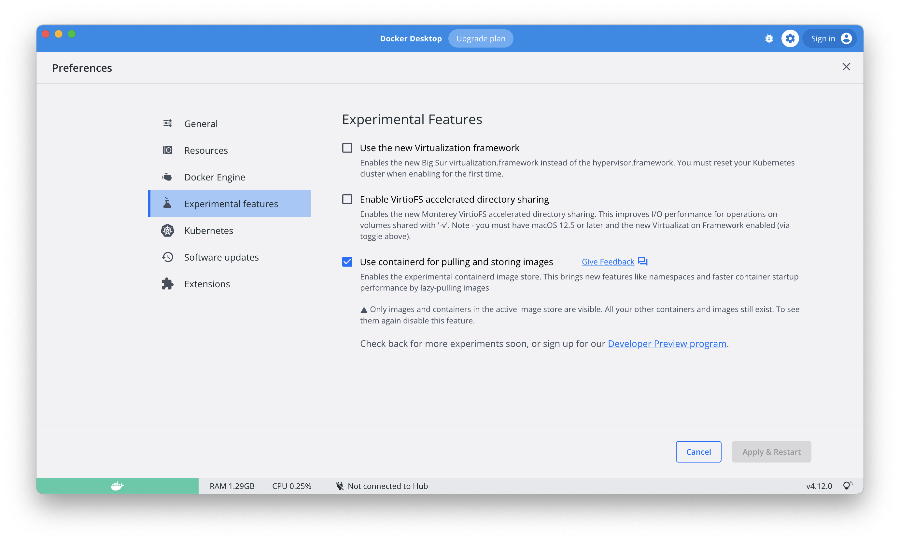

# Multi-arch docker builds

Command to build and run a multi-platform docker image

```
-> % docker buildx build --platform linux/amd64,linux/arm64 -t hello .
-> % docker run hello
```

Enabling the Containerd image store feature

The Containerd Image Store beta feature is switched off by default.

To enable this feature:

- Navigate to Settings, or Preferences if you’re a Mac user.
- Select the Experimental features tab.
- Next to Use containerd for pulling and storing images, select the checkbox.
- To disable this feature, clear the Use containerd for pulling and storing images checkbox.



For more details about this feature, please look at this [page](https://docs.docker.com/desktop/containerd/)


Otherwise you can either `build` and `load` or `build` and `push`

```
-> % docker buildx build --platform linux/amd64,linux/arm64 -t [USER]/hello . --push
-> % docker run [USER]/hello
```

The first command builds the images and pushes them to Docker hub. The second one it's a good old `docker run` that will pull the image.

```
-> % docker buildx build --platform linux/amd64,linux/arm64 -t [USER]/hello .
-> % docker buildx build --platform linux/arm64 -t [USER]/hello . --load
-> % docker run [USER]/hello
```

The first command builds the multi-arch image, the second one, loads the image of the right architecture into docker (you will see the image when you do `docker images`), the third one runs the image.
